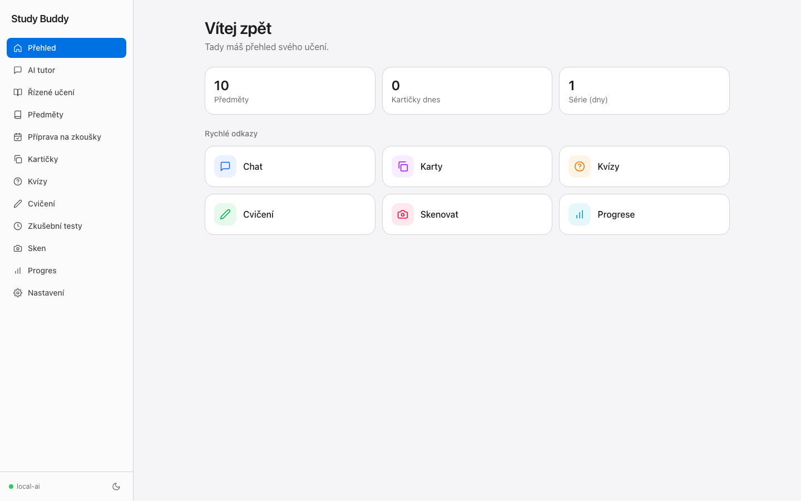
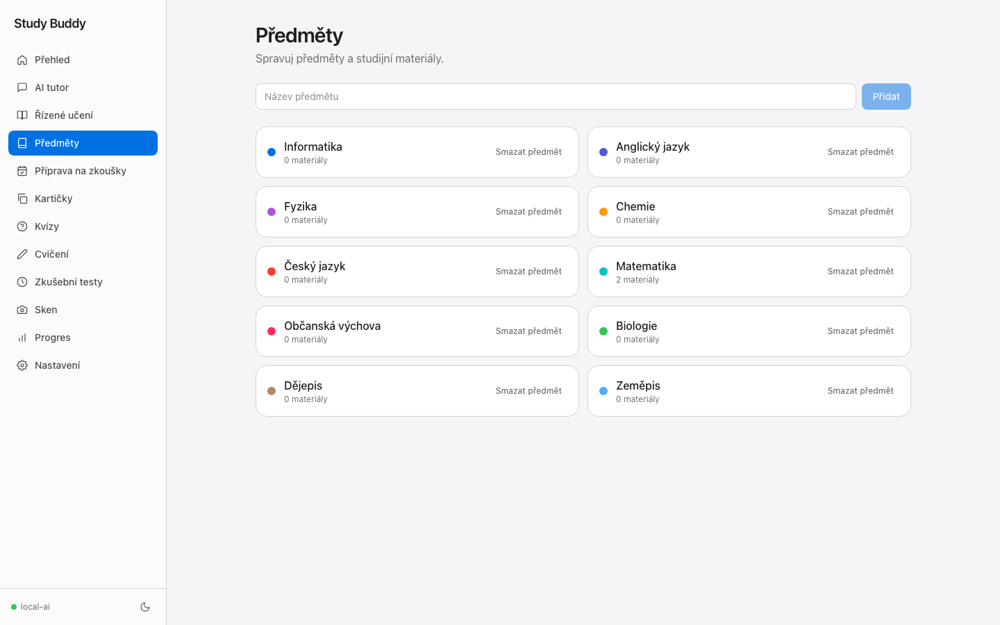
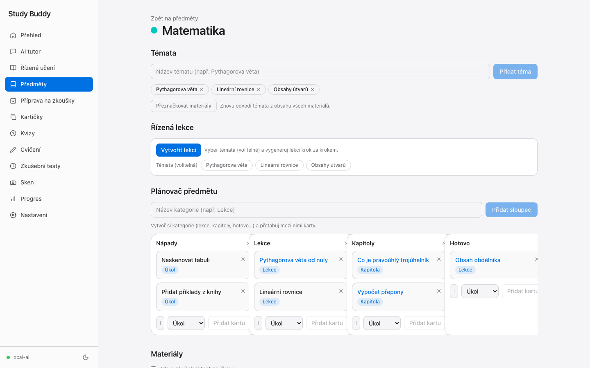
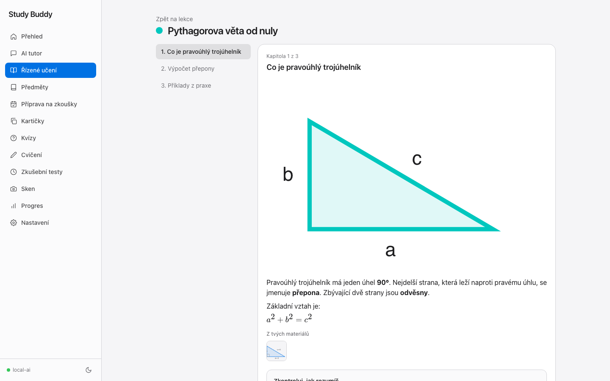
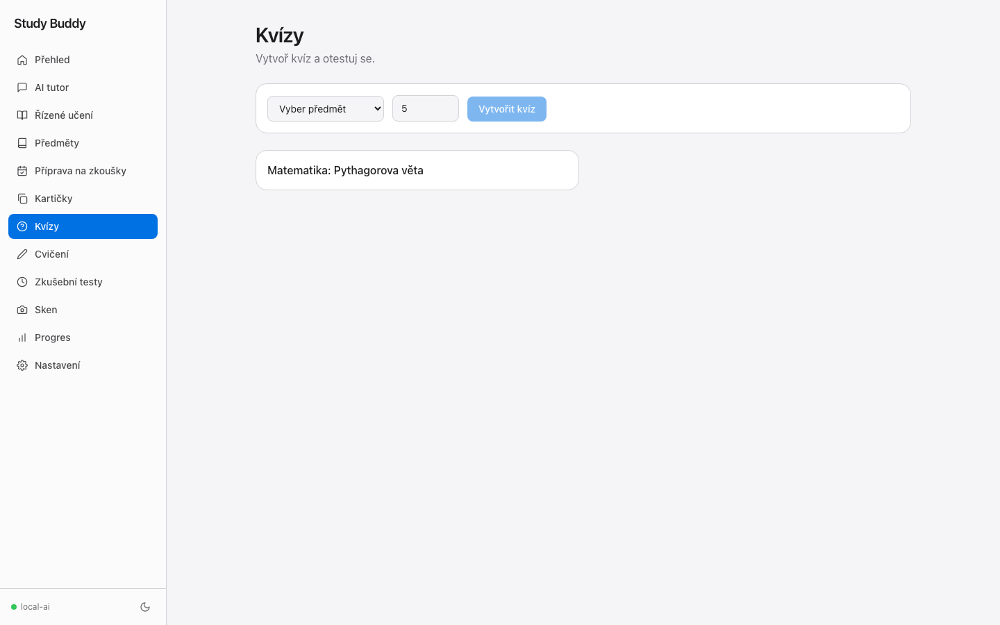
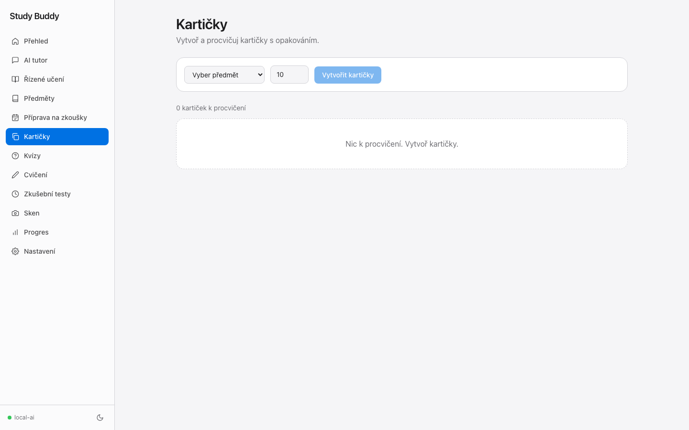

# Study Buddy

A private, browser-based study companion for a single student, powered by a local
LLM. It runs as one Docker container on your home server (TrueNAS Scale) and talks
to your local model over the LAN. No data leaves your network.

## Features

- **Subjects & materials** — organize subjects; upload PDFs, images, or text.
- **Material containers** — create your own categories (lessons, chapters, done…) and drag uploaded photos/materials or custom cards between them.
- **Guided learning** — build a lesson from a subject's notes, then read it chapter by chapter.
- **AI tutor** — Socratic chat grounded in a subject's materials (streaming).
- **Exam prep** — generate a day-by-day study plan from an exam date + level.
- **Flashcards** — generate cards and review them with FSRS spaced repetition.
- **Quizzes** — generate multiple-choice quizzes, take them, get graded.
- **Practice** — open-ended exercises with step-by-step solutions, plus true/false drills.
- **Scan** — photograph a page and OCR it to text (uses the model's vision).
- **Progress** — activity, streaks, and per-subject mastery.
- **i18n** — Czech and English (cookie-based, easy to extend).

## Screenshots

Dashboard with demo content:



Subjects:



Material containers with uploaded materials and draggable cards:



Guided lesson reader:



Quizzes:



Flashcards:



## Tech stack

Next.js (App Router) · React · TypeScript · Tailwind CSS · SQLite (better-sqlite3) ·
OpenAI-compatible client (llama-swap) · next-intl · Vitest. Built as a `standalone`
server for a small Docker image.

## Local development

```bash
npm install
cp .env.example .env.local   # then edit values
npm run dev                  # http://localhost:3000
```

Useful scripts:

```bash
npm run typecheck   # tsc --noEmit
npm run lint        # eslint .
npm run build       # production build
npm test            # vitest (unit tests)
npm run seed:demo   # add Czech demo content for screenshots/testing
```

For the screenshots above, start the app once so the database is created, then run:

```bash
npm run dev
# open http://localhost:3000 once, then in another terminal:
npm run seed:demo
```

## Configuration

Environment variables (see `.env.example`):

| Var            | Default                          | Description                                  |
| -------------- | -------------------------------- | -------------------------------------------- |
| `LLM_BASE_URL` | `http://192.168.1.136:8080/v1/`  | OpenAI-compatible endpoint (llama-swap).     |
| `LLM_MODEL`    | `local-ai`                       | Model id exposed by the router.              |
| `LLM_API_KEY`  | `local`                          | Ignored by llama-swap; some servers need it. |
| `PORT`         | `3000`                           | Port the server listens on.                  |
| `DATA_DIR`     | `./data`                         | Where the SQLite DB + uploads live.          |
| `APP_PASSWORD` | *(empty)*                        | Optional LAN password gate (empty = off).    |

The LLM must support **vision** for the Scan feature (the current `local-ai`
router does).

## Deploy on TrueNAS Scale (Docker)

1. **Copy the project** to a folder on the NAS, e.g. `/mnt/tank/apps/study-buddy`.
2. **Create a dataset** for data (so the DB + uploads survive rebuilds), e.g.
   `/mnt/tank/apps/study-buddy-data`.
3. **Set the dataset's permissions** so the container user (uid `1000`) can write:
   in the TrueNAS UI, set the dataset's owner to uid `1000` (or make it world-writable).
4. **Edit `docker-compose.yml`**:
   - Point the volume at your dataset: `- /mnt/tank/apps/study-buddy-data:/app/data`
   - Set `APP_PASSWORD` if you want the password gate.
   - Confirm `LLM_BASE_URL` reaches your AI host from the NAS.
5. **Start it** — either pull the published image (recommended) or build locally:
   ```bash
   cd /mnt/tank/apps/study-buddy
   # Pull the image auto-published by GitHub Actions (push code -> image updates):
   docker compose pull
   docker compose up -d
   # ...or build from source on the NAS instead:
   # docker compose up -d --build
   ```
6. **Open** `http://<nas-ip>:3000` from any device on the LAN.

### Alternative: install as a custom app via YAML (TrueNAS UI)

Instead of the CLI, you can install it from the Apps UI:

1. Create the data dataset first (steps 2–3 above) — the wizard cannot create
   storage mid-install.
2. In the TrueNAS UI go to **Apps** → **Discover**, click the ⋮ (more) menu and
   choose **Install via YAML**.
3. Enter a name, e.g. `study-buddy`, and paste the YAML below into
   **Custom Config** (adjust the dataset path and `LLM_BASE_URL`). Paste only
   the YAML — no ` ``` ` code fences.
4. Click **Save** to deploy. The app appears on the **Installed Applications**
   screen; open `http://<nas-ip>:3000`.

```yaml
name: study-buddy
services:
  study-buddy:
    image: ghcr.io/cipgysmo/study-buddy:latest
    ports:
      - "3000:3000"
    environment:
      LLM_BASE_URL: "http://192.168.1.136:8080/v1/"
      LLM_MODEL: "local-ai"
      DATA_DIR: "/app/data"
      PORT: "3000"
      # Optional LAN password gate. Set a value to require it on every visit.
      # APP_PASSWORD: "change-me"
    volumes:
      # Point at a dataset owned by uid 1000 (see steps above).
      - /mnt/tank/apps/study-buddy-data:/app/data
    restart: unless-stopped
    security_opt:
      - no-new-privileges:true
    cap_drop:
      - ALL
    mem_limit: 1g
    cpus: "2.0"
```

Notes:

- The YAML editor has no source on the NAS, so `build:` is not supported — this
  uses the published GHCR image.
- TrueNAS re-saves the YAML without comments and in its own formatting; edit it
  later via the app's **Edit** → **Edit App YAML** window.
- To update, edit and save the YAML to redeploy. To force a fresh image pull,
  either switch the tag from `latest` to a specific `sha` tag (see below) and
  back, or pull the new image from the shell (over SSH on the NAS) and then
  recreate the container so it runs it:
  ```bash
  docker pull ghcr.io/cipgysmo/study-buddy:latest
  ```
  A plain `docker restart` keeps the old image — recreate via the app's
  **Restart**/**Update** in the Apps UI (or remove + redeploy).

### Publishing the image (GHCR)

The image is published automatically to GitHub Container Registry. Pushing to
`main` runs `.github/workflows/publish.yml`, which builds and pushes
`ghcr.io/cipgysmo/study-buddy:latest` (plus a `sha` tag). To update the app on
the NAS, pull the new image again:

- **Docker Compose** deployment (run from the folder with `docker-compose.yml`):
  ```bash
  docker compose pull && docker compose up -d
  ```
- **Custom app** (Apps UI) — over SSH on the NAS:
  ```bash
  docker pull ghcr.io/cipgysmo/study-buddy:latest
  ```
  then recreate the container (see the custom-app notes above).

The workflow uses the built-in `GITHUB_TOKEN` (needs `packages: write`, already
set), so no extra secrets are required.

The container runs as a non-root user, drops all capabilities, and has a health
check. Data persists in the mounted dataset.

The restart policy is not set in the `Dockerfile`; Docker restart policies are
runtime configuration. It is set by the deployment files (`docker-compose.yml`
and the TrueNAS custom-app YAML) as `restart: unless-stopped`.

## Notes

- The app is single-user by design; the optional `APP_PASSWORD` gate is the only
  access control. Keep it on a trusted LAN.
- To add a language, add `src/i18n/locales/<code>.json` and register it in
  `src/i18n/languages.ts`.
